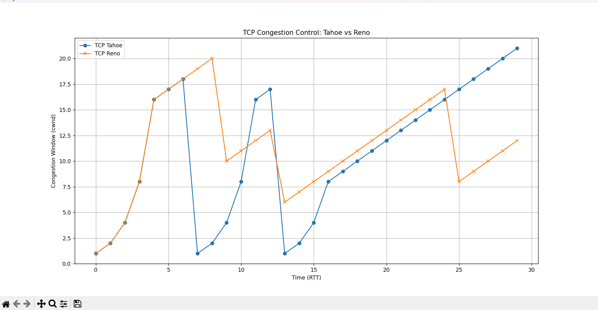

# TCP Congestion Control Simulator (Tahoe vs Reno)

##  Overview
This project simulates TCP congestion control algorithms: **Tahoe** and **Reno**.

It demonstrates how the congestion window (cwnd) evolves over time under normal conditions and packet loss.


##  Concepts Covered
- Slow Start (Exponential growth)
- Congestion Avoidance (Linear growth)
- Packet Loss Handling
- Difference between TCP Tahoe and TCP Reno


##  Features
- Simulation of TCP Tahoe and Reno
- Random packet loss (realistic behavior)
- cwnd vs time graph visualization
- Performance comparison using average cwnd


##  Output
- Graph showing cwnd growth for both algorithms
- Logs of packet loss events
- Average cwnd comparison


##  Key Observation
- TCP Reno performs better than Tahoe as it reduces cwnd to half instead of resetting to 1 after packet loss.


## Tech Stack
- Python
- Matplotlib


##  How to Run
```bash
pip install matplotlib
python main.py


